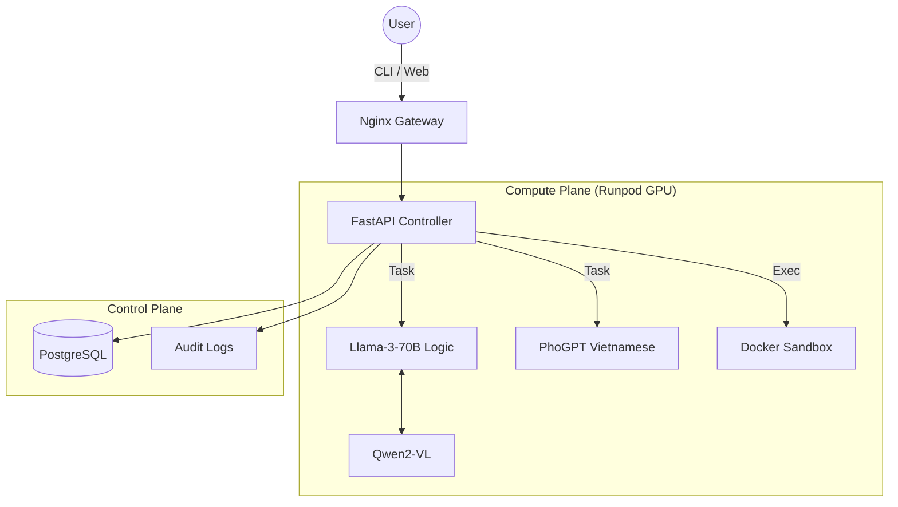

# 🤖 Phil AI Agent (phil-cli)

**Phil Agentic AI System** - Hệ thống AI Tự chủ Đa phương thức (Multimodal), có khả năng Nghe, Nói, Nhìn, Lập trình và Tự học.


## 📖 Giới thiệu

**Phil AI Agent** là một tác nhân AI toàn năng được thiết kế để chạy **Self-hosted** (tự lưu trữ), đảm bảo quyền riêng tư tuyệt đối và khả năng mở rộng không giới hạn thông qua giao thức MCP (Model Context Protocol).

Hệ thống hoạt động dựa trên kiến trúc **Dual-Brain**:
1.  **🛡️ Security Layer (The Gatekeeper):**
    * **Nginx Gateway:** Quản lý lưu lượng, Rate Limiting (chống DDoS), Routing và SSL Termination.
    * **Isolation:** Mỗi người dùng có không gian Workspace riêng biệt, đảm bảo dữ liệu không bị lộ.

2.  **🧠 The Dual-Brain Core:**
    * **Logic Engine:** `Llama-3-70B-Instruct` (AWQ) - Xử lý tư duy phức tạp, MPC Planning.
    * **Language Soul:** `PhoGPT-4B` - Chuyên trách văn hóa và ngôn ngữ Tiếng Việt.

3.  **👁️👂🗣️ Sensory Modules:**
    * **Vision:** `Qwen2-VL` (OCR & Image Understanding).
    * **Hearing:** `Faster-Whisper Large-v3` (High-fidelity STT).
    * **Speech:** `XTTS-v2` (Multilingual TTS with Voice Cloning).

4.  **🔌 Expansion & Action:**
    * **MCP Protocol:** Kết nối Telegram, Discord, Zalo (Puppeteer), Git, Database.
    * **Docker Sandbox:** Môi trường thực thi code an toàn.

---

Hệ thống hoạt động theo mô hình **Client-Server** bảo mật:



---

## 📂 Cấu trúc dự án

```text
PHIL-CLI/
├── .env.example                # Mẫu cấu hình môi trường
├── .gitignore
├── README.md                   # Tài liệu dự án (Server)
├── docker-compose.yml          # Hạ tầng triển khai (Single Node)
├── deploy_k8s.sh               # Script triển khai K8s
├── requirements.txt            # Thư viện Python cho Server
├── mcp_servers_config.json     # Cấu hình MCP (Zalo, Git...)
│
├── k8s/                        # [MỚI] Cấu hình Kubernetes
│   ├── 01-storage.yaml
│   ├── 02-brains.yaml
│   ├── 03-app.yaml
│   └── 04-ingress.yaml
│
├── nginx/                      # [MỚI] Cấu hình Gateway
│   ├── nginx.conf
│   └── .htpasswd
│
├── sandbox/                    # [MỚI] Môi trường thực thi code
│   └── Dockerfile              # Base Image chung (Sandbox + API)
│
├── package/        # [MỚI] Client CLI (Gói cài đặt cho User)
│   ├── setup.py
│   ├── requirements.txt
│   ├── README.md
│   └── phil_cli/
│       ├── __init__.py
│       ├── main.py             # Entry point (Typer CLI)
│       ├── api.py              # Requests logic
│       └── config.py           # Local config storage
│
├── src/                        # [CORE] Mã nguồn Backend Server
│   ├── __init__.py
│   ├── api_server.py           # FastAPI Controller (Main Entry)
│   ├── agent_graph.py          # LangGraph Logic (Bộ não điều phối)
│   ├── mpc_planner.py          # Thuật toán lập kế hoạch
│   │
│   ├── database/               # [MỚI] Database Module
│   │   ├── __init__.py
│   │   ├── session.py          # Kết nối PostgreSQL
│   │   └── models.py           # Định nghĩa User, AuditLog
│   │
│   ├── services/               # [MỚI] Business Logic
│   │   ├── audit.py            # Ghi log kiểm toán
│   │   └── auth.py             # Xử lý JWT/API Key
│   │
│   ├── tools/                  # Các công cụ (Tools)
│   │   ├── tools_code.py       # Chạy code trong Sandbox
│   │   ├── tools_project.py    # Xử lý file/zip dự án
│   │   ├── tools_vision.py     # Xử lý ảnh
│   │   ├── tools_audio.py      # Xử lý âm thanh
│   │   └── mcp_wrapper.py      # Kết nối MCP
│   │
│   └── skills/                 # Quản lý kỹ năng học được
│       ├── skills_manager.py
│       └── registry.json
│
└── workspace/                  # Thư mục dữ liệu động (Mount ra ngoài)
    ├── users/                  # Workspace riêng cho từng user
    ├── skills/                 # Code các skill đã học
    └── models/                 # Cache model HuggingFace
```

## 🚀 Tính Năng Nổi Bật

| Tính năng | Mô tả |
| :--- | :--- |
| **Global Scalability** | Hỗ trợ phục vụ đồng thời nhiều user nhờ Nginx Load Balancing và Async Queue. |
| **Model Predictive Control** | Sử dụng thuật toán MPC để lập kế hoạch nhiều bước (Thinking -> Planning -> Coding -> Review). |
| **Coding Master** | Tự động viết, chạy, debug code Python/Bash trong Sandbox bị cô lập. |
| **Full Multimodal** | Nghe giọng nói, nhìn hình ảnh/tài liệu và phản hồi bằng giọng nói tự nhiên. |
| **Self-Evolution** | Tự động fine-tune model (Unsloth) sau mỗi chu kỳ hoạt động để thông minh hơn. |

---

## Cài đặt

### 1. Yêu cầu phần cứng

* **Server:** GPU Cluster (Runpod/AWS/GCP) với tối thiểu 1x A100 (80GB VRAM) hoặc 2x A6000.
* **Storage:** 200GB SSD.
* **Docker & Docker Compose.**

### Bước 1: Thiết lập Môi trường
```bash
# Clone repository
git clone [https://github.com/your-repo/phil-cli.git](https://github.com/your-repo/phil-cli.git)
cd phil-cli

# Cấu hình biến môi trường (Bảo mật)
cp .env.example .env
# Chỉnh sửa .env: Thêm API Keys, Tokens cho Telegram/Discord
```

### Bước 2: Khởi động Hệ thống (Backend)

```bash
# Chạy hạ tầng AI & Gateway bảo mật
docker-compose up -d

# Kiểm tra trạng thái
docker-compose ps
```
Lúc này, hệ thống sẽ ẩn toàn bộ port 8000-8004 và chỉ mở port **80 (HTTP)** hoặc **443 (HTTPS).**

### Bước 3: Client Connection
Bạn có thể kết nối với Phil thông qua 3 giao diện:
1. **CLI (Terminal):** Dành cho Developer.
```bash
python cli.py --user="admin"
```
2. **Web UI (Streamlit):** Dành cho End-user.
```bash
streamlit run ui/app.py
```
3. **API Integration:** Tích hợp vào Mobile App hoặc Website khác.
Endpoint: `http://your-server-ip/api/coder/v1/chat/completions`

---

### 🔌 Mở rộng (MCP)
Để kết nối thêm công cụ (ví dụ: Google Drive, Slack), hãy chỉnh sửa file `mcp_servers_config.json`:

```bash
"gdrive": {
    "command": "npx",
    "args": ["-y", "@modelcontextprotocol/server-gdrive"]
}
```

### 🔒 Bảo Mật & Multi-tenancy
Để phục vụ toàn cầu, hệ thống áp dụng các quy chuẩn:
* **API Key Authentication:** Mọi request phải có Header Authorization.

* **Rate Limiting**: Giới hạn 60 requests/phút mỗi user để bảo vệ GPU.

* **Sandboxing:** Code của user A chạy trong container tách biệt với user B (Cần cấu hình Kubernetes cho Production).


### 🤝 Đóng Góp (Contributing)
Dự án Phil AI Agent là mã nguồn mở. Chúng tôi chào đón mọi đóng góp về:

* Tối ưu hóa MPC Planner.

* Thêm MCP Server mới (Notion, Slack...).

* Cải thiện bộ dataset Tiếng Việt cho PhoGPT.

### 📜 License
MIT License. Created by PHGroup.

1. 🏗️ **Kiến trúc AI Agent Production (SaaS Scale)**
Chúng ta sẽ chuyển từ kiến trúc Monolithic (Docker Compose đơn giản) sang kiến trúc **Microservices trên Kubernetes (K8s)** để đảm bảo khả năng mở rộng (Scaling) và chịu lỗi (Fault Tolerance).
**Sơ đồ luồng dữ liệu:**
1. **Clients (Đa nền tảng):**
* **Phil CLI:** Dành cho Developer (Terminal).
* **Web Dashboard:** Dành cho Manager (Quản lý Users, Billing, Audit Logs).
* **IDE Extension:** Plugin cho VS Code/IntelliJ (Code trực tiếp).
2. **Gateway Layer (Cổng an ninh):**
* **Load Balancer:** Phân phối tải.
* **API Gateway (Kong/Nginx):** Rate Limiting, xác thực API Key, Routing.
* **WAF (Web Application Firewall):** Chống tấn công DDoS, SQL Injection.
3. **Control Plane (Bộ não quản lý - CPU Only):** 
* **Auth Service:** Quản lý User, SSO (Google, Microsoft), RBAC.
* **Billing Service:** Tính toán Token usage, tích hợp Stripe/PayPal.
* **Orchestrator (Manager):** Nhận request, đẩy vào hàng đợi (Queue).
* **Database:** PostgreSQL (User data), Redis (Queue & Cache).
4. **Compute Plane (Nhà máy AI - GPU Heavy):**
* Các worker này sẽ auto-scale dựa trên độ dài hàng đợi.
* **Inference Cluster:** Chạy vLLM (Llama-3, Qwen2, PhoGPT).
* **Tool Sandbox Cluster:** Chạy Docker container cô lập để thực thi code an toàn.
---
2. 🚀 **Định vị Sản phẩm (Product Positioning)**
**"Phil AI Workforce Platform"**
**Slogan**: Your Phil AI DevOps Engineer. Private. Secure. Limitless.
| Gói(Package) | Đối tượng(Personal) | Tính năng (Feature Set) | Giá trị cốt lỗi (USP) |
| :--- | :--- | :--- | :--- |
| **Developer (Free/Pro)** | Cá nhân, Freelancer | CLI, Basic Chat, Code Fix (1 dự án/lần). | Giá trị **Nhanh & Tiện:** Cài đặt 1 lệnh không cần GPU xịn. |
| **Team (SaaS)Startups** | Dev Teams | Web UI, Share Knowledge (RAG), Multi-user, CI/CD Integration. | **Cộng tác:** AI hiểu context của cả team, không phải dạy lại từ đầu. |
| **Enterprise (Self-hosted)** | Ngân hàng, Gov, Corp | Triển khai On-Premise, Audit Logs, SSO, VPN Support, SLA 99.9%. | **Bảo mật & Kiểm soát:** Dữ liệu code không bao giờ rời khỏi server công ty. |
---
3. 🔐 **Chuẩn hóa Agent cho Doanh nghiệp (Enterprise Readiness)**
**A. Bảo mật & Định danh (Identity & Access)**
* **SSO (Single Sign-On):** Doanh nghiệp không dùng user/pass thường. Họ dùng Okta, Active Directory hoặc Google Workspace.
 * Tech stack: Tích hợp `Dex` hoặc `Keycloak` vào Auth Service.
* **RBAC (Role-Based Access Control):**
 * `Admin`: Quản lý billing, xem log toàn hệ thống.
 * `Developer`: Được chạy code, tạo API Key.
 * `Viewer`: Chỉ được xem lịch sử chat (cho Project Manager).
* **Audit Logs (Nhật ký kiểm toán):**
 * Ghi lại **mọi hành động:** "Ai? Làm gì? Lúc nào? Tại sao?".
 * Ví dụ: "User A yêu cầu AI xóa database lúc 10:00 AM". Đây là tính năng sống còn để quy trách nhiệm.
**B. An toàn dữ liệu (Data Privacy)**
* **Data Isolation (Cô lập dữ liệu):**
 * Dữ liệu Vector (RAG) của Công ty A không được để Công ty B tìm thấy.
 * Giải pháp: Dùng Namespace trong Vector DB hoặc mô hình Single-tenant (Mỗi khách hàng 1 Database riêng).
* **PII Redaction (Che thông tin nhạy cảm):**
 * Trước khi gửi text lên LLM, phải có module tự động quét và che Số điện thoại, Email, Số thẻ tín dụng, API Key (nếu lỡ paste vào).
**C. Quy trình chuẩn hóa Code (Compliance)**
Doanh nghiệp cần AI viết code chuẩn, không phải code chạy được là xong.
* **Linting & Security Scan:** Khi Phil viết code xong, trước khi trả về cho user, code đó phải được chạy qua `SonarQube` hoặc `Bandit` (Python security scanner) trong Sandbox để đảm bảo không có lỗ hổng bảo mật.

---

4. **Roadmap chuyển đổi (Next Steps)**
**Giai đoạn 1: MVP (Hiện tại)**
* Docker Compose.Auth cơ bản (SQLite).CLI Client.
* Mục tiêu: Chứng minh tính năng (Proof of Concept).
**Giai đoạn 2: Cloud SaaS (Tháng tới)Tách Frontend (Next.js) và Backend (FastAPI).**
* Dùng PostgreSQL thay SQLite.
* Tích hợp Stripe/Paypal subscription.
* Deploy lên K8s (Cluster nhỏ).
* Mục tiêu: Có doanh thu đầu tiên (MRR).
**Giai đoạn 3: Enterprise (Quý tới)Xây dựng module Audit Logs & SSO.**
Hỗ trợ triển khai "Air-gapped" (Không internet) cho khách hàng bảo mật cao.
Đạt chứng chỉ SOC2 (Lâu dài).
