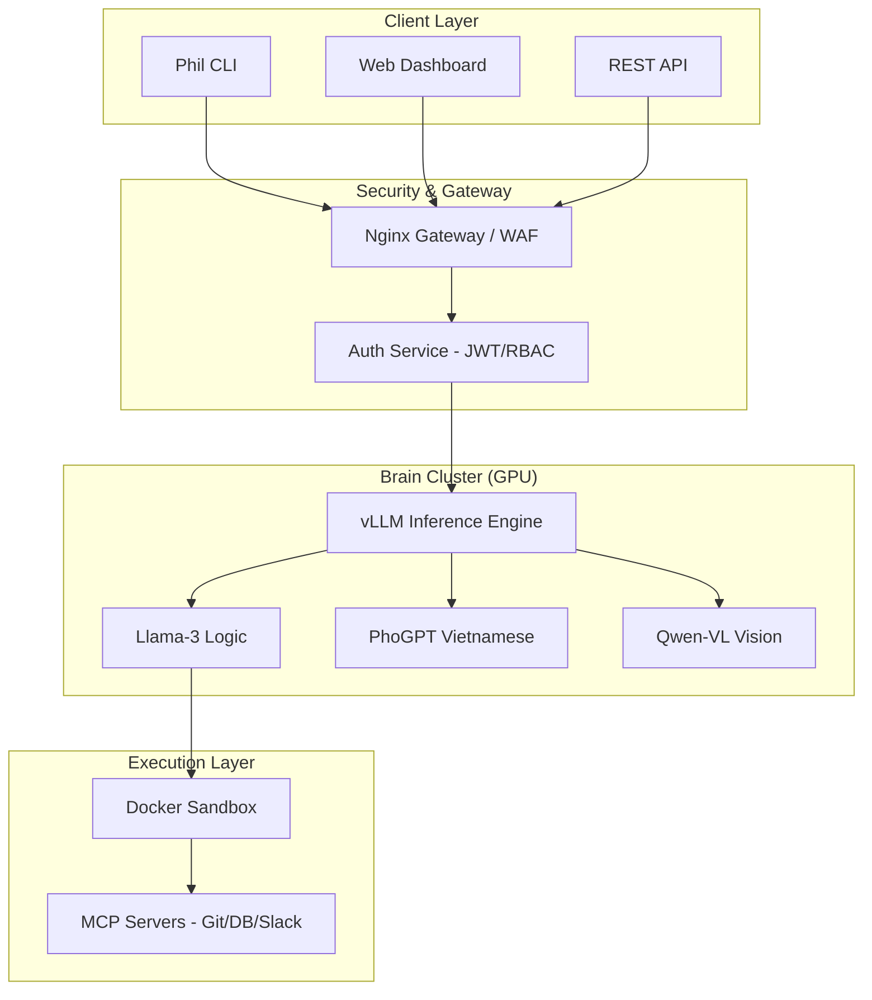

# 🤖 Phil AI Agent (phil-cli)

**Phil Agentic AI System** - Hệ thống AI Tự chủ Đa phương thức (Multimodal) dành cho Doanh nghiệp. Tích hợp khả năng Nghe, Nói, Nhìn, Lập trình và Tự học trong một môi trường bảo mật tuyệt đối.


## 📖 Giới thiệu

**Phil AI Agent** là một tác nhân AI toàn năng được thiết kế để chạy **Self-hosted** (tự lưu trữ), đảm bảo quyền riêng tư tuyệt đối và khả năng mở rộng không giới hạn thông qua giao thức MCP (Model Context Protocol).

Hệ thống hoạt động dựa trên kiến trúc **Dual-Brain**:
1.  **🛡️ Security Layer (The Gatekeeper):**
    * **Nginx Gateway:** Quản lý lưu lượng, Rate Limiting (chống DDoS), Routing và SSL Termination.
    * **Isolation:** Mỗi người dùng có không gian Workspace riêng biệt, đảm bảo dữ liệu không bị lộ.

2.  **🧠 The Dual-Brain Core:**
    * **Logic Engine:** `Llama-3-70B-Instruct` (AWQ) - Xử lý tư duy phức tạp, MPC Planning.
    * **Language Soul:** `PhoGPT-4B` - Chuyên trách văn hóa và ngôn ngữ Tiếng Việt.

3.  **👁️👂🗣️ Sensory Modules:**
    * **Vision:** `Qwen2-VL` (OCR & Image Understanding).
    * **Hearing:** `Faster-Whisper Large-v3` (High-fidelity STT).
    * **Speech:** `XTTS-v2` (Multilingual TTS with Voice Cloning).

4.  **🔌 Expansion & Action:**
    * **MCP Protocol:** Kết nối Telegram, Discord, Zalo (Puppeteer), Git, Database.
    * **Docker Sandbox:** Môi trường thực thi code an toàn.

---

## 🌟 Tại sao chọn Phil AI cho Doanh nghiệp?

Phil AI không chỉ là một chatbot; đó là một **Nhân viên AI (AI Workforce)** có khả năng thực thi các tác vụ kỹ thuật phức tạp trên hạ tầng riêng của doanh nghiệp.

| Tính năng | Lợi ích cho Doanh nghiệp |
| --- | --- |
| **Self-hosted (On-premise)** | Dữ liệu và mã nguồn không bao giờ rời khỏi hạ tầng của công ty. Đảm bảo tuân thủ các tiêu chuẩn bảo mật khắt khe nhất. |
| **Dual-Brain Architecture** | Kết hợp sức mạnh logic của `Llama-3-70B` và sự am hiểu văn hóa Việt của `PhoGPT`. |
| **Autonomous Coding** | Tự động viết, kiểm thử và sửa lỗi mã nguồn trong môi trường Sandbox an toàn. |
| **Enterprise Security** | Tích hợp sẵn hệ thống Audit Logs, RBAC (Phân quyền dựa trên vai trò) và API Gateway. |
| **Scalability** | Sẵn sàng triển khai trên Kubernetes, hỗ trợ hàng ngàn người dùng đồng thời. |

---

## 🏗️ Kiến trúc Hệ thống

Hệ thống được thiết kế theo mô hình Microservices hiện đại, tối ưu cho việc mở rộng và bảo mật.



---

## 📂 Cấu trúc dự án

```text
PHIL-CLI/
├── .env.example                # Mẫu cấu hình môi trường
├── .gitignore
├── README.md                   # Tài liệu dự án (Server)
├── docker-compose.yml          # Hạ tầng triển khai (Single Node)
├── deploy_k8s.sh               # Script triển khai K8s
├── requirements.txt            # Thư viện Python cho Server
├── mcp_servers_config.json     # Cấu hình MCP (Zalo, Git...)
│
├── k8s/                        # [MỚI] Cấu hình Kubernetes
│   ├── 01-storage.yaml
│   ├── 02-brains.yaml
│   ├── 03-app.yaml
│   └── 04-ingress.yaml
│
├── nginx/                      # [MỚI] Cấu hình Gateway
│   ├── nginx.conf
│   └── .htpasswd
│
├── sandbox/                    # [MỚI] Môi trường thực thi code
│   └── Dockerfile              # Base Image chung (Sandbox + API)
│
├── package/        # [MỚI] Client CLI (Gói cài đặt cho User)
│   ├── setup.py
│   ├── requirements.txt
│   ├── README.md
│   └── phil_cli/
│       ├── __init__.py
│       ├── main.py             # Entry point (Typer CLI)
│       ├── api.py              # Requests logic
│       └── config.py           # Local config storage
│
├── src/                        # [CORE] Mã nguồn Backend Server
│   ├── __init__.py
│   ├── api_server.py           # FastAPI Controller (Main Entry)
│   ├── agent_graph.py          # LangGraph Logic (Bộ não điều phối)
│   ├── mpc_planner.py          # Thuật toán lập kế hoạch
│   │
│   ├── database/               # [MỚI] Database Module
│   │   ├── __init__.py
│   │   ├── session.py          # Kết nối PostgreSQL
│   │   └── models.py           # Định nghĩa User, AuditLog
│   │
│   ├── services/               # [MỚI] Business Logic
│   │   ├── audit.py            # Ghi log kiểm toán
│   │   └── auth.py             # Xử lý JWT/API Key
│   │
│   ├── tools/                  # Các công cụ (Tools)
│   │   ├── tools_code.py       # Chạy code trong Sandbox
│   │   ├── tools_project.py    # Xử lý file/zip dự án
│   │   ├── tools_vision.py     # Xử lý ảnh
│   │   ├── tools_audio.py      # Xử lý âm thanh
│   │   └── mcp_wrapper.py      # Kết nối MCP
│   │
│   └── skills/                 # Quản lý kỹ năng học được
│       ├── skills_manager.py
│       └── registry.json
│
└── workspace/                  # Thư mục dữ liệu động (Mount ra ngoài)
    ├── users/                  # Workspace riêng cho từng user
    ├── skills/                 # Code các skill đã học
    └── models/                 # Cache model HuggingFace
```

## Cài đặt

### 1. Yêu cầu Hệ thống

- **GPU:** Tối thiểu 24GB VRAM (RTX 3090/4090) cho bản rút gọn, hoặc A100 cho bản đầy đủ.

- **OS:** Ubuntu 22.04+ với Docker & NVIDIA Container Toolkit.

### 2. Cài đặt Server

```bash
git clone https://github.com/hoang0650/phil-cli.git
cd phil-cli
cp .env.example .env
# Cấu hình API Keys và Model Paths trong .env
docker-compose up -d
```

### 3. Cài đặt Client (CLI )

```bash
pip install ./phil-cli/package
phil-cli login <YOUR_API_KEY> --server http://your-server-ip:8080
phil-cli chat
```

---

## 🛠️ Các lệnh CLI chính

- `phil-cli login`: Xác thực với hệ thống.

- `phil-cli chat`: Bắt đầu phiên làm việc tương tác.

- `phil-cli fix <path>`: Tự động phân tích và sửa lỗi toàn bộ dự án trong thư mục.

- `phil-cli status`: Kiểm tra tình trạng kết nối và tài nguyên.

---

### 🔌 Mở rộng (MCP)
Để kết nối thêm công cụ (ví dụ: Google Drive, Slack), hãy chỉnh sửa file `mcp_servers_config.json`:

```bash
"gdrive": {
    "command": "npx",
    "args":["-y", "@modelcontextprotocol/server-gdrive"]}
```

### 🔒 Bảo Mật & Multi-tenancy
Để phục vụ toàn cầu, hệ thống áp dụng các quy chuẩn:
* **API Key Authentication:** Mọi request phải có Header Authorization.

* **Rate Limiting**: Giới hạn 60 requests/phút mỗi user để bảo vệ GPU.

* **Sandboxing:** Code của user A chạy trong container tách biệt với user B (Cần cấu hình Kubernetes cho Production).


### 🤝 Đóng Góp (Contributing)
Dự án Phil AI Agent là mã nguồn mở. Chúng tôi chào đón mọi đóng góp về:

* Tối ưu hóa MPC Planner.

* Thêm MCP Server mới (Notion, Slack...).

* Cải thiện bộ dataset Tiếng Việt cho PhoGPT.

---

## 📈 Lộ trình Phát triển (Roadmap )

- [x] **Giai đoạn 1:** MVP với Docker Compose và CLI cơ bản.

- [ ] **Giai đoạn 2:** Tích hợp vLLM để tối ưu tốc độ phản hồi (Inference Speed).

- [ ] **Giai đoạn 3:** Hệ thống Dashboard quản trị tập trung cho doanh nghiệp.

- [ ] **Giai đoạn 4:** Hỗ trợ Fine-tuning tự động dựa trên dữ liệu riêng của khách hàng.

---

## 🤝 Liên hệ Hợp tác

Dự án được phát triển bởi **PHGROUP TECHNOLOGY SOLUTIONS CO., LTD**. Chúng tôi cung cấp các giải pháp tùy chỉnh AI cho doanh nghiệp:

- Triển khai AI Agent riêng tư.

- Huấn luyện mô hình ngôn ngữ theo dữ liệu chuyên ngành.

- Tích hợp AI vào quy trình vận hành sẵn có.

**Email:** [contact@phgrouptechs.com](mailto:contact@phgrouptechs.com) | **Website:** [https://phgrouptechs.com](https://phgrouptechs.com)

---

*© 2026 PHGROUP TECHNOLOGY SOLUTIONS CO., LTD*

