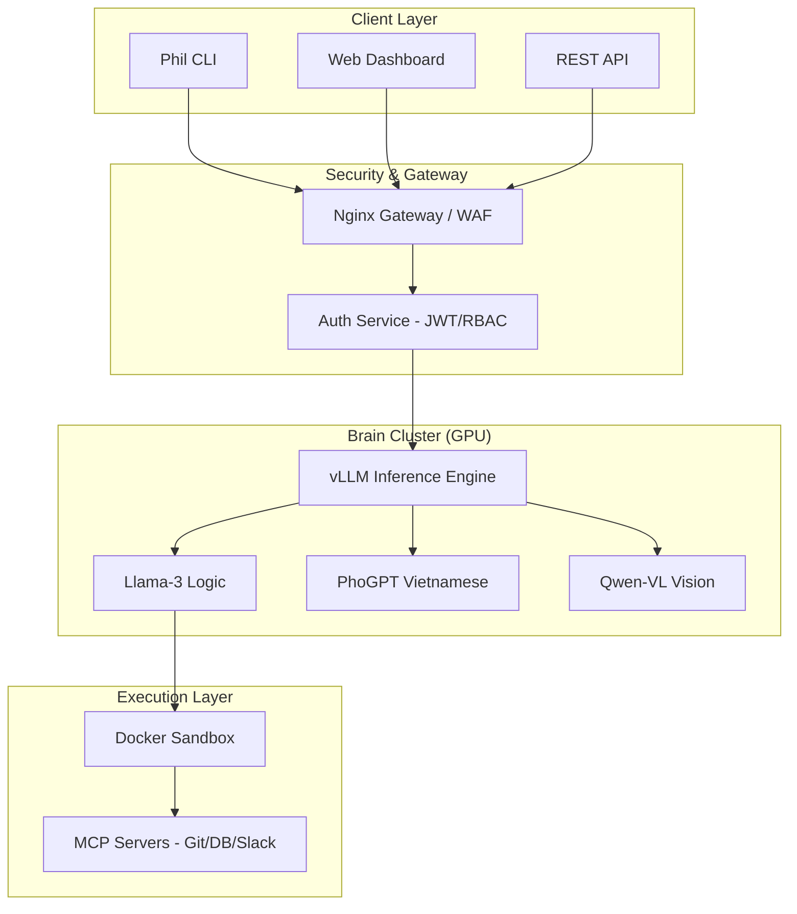

# 🤖 Phil AI Agent (phil-cli)

**Phil Agentic AI System** - Hệ thống AI Tự chủ Đa phương thức (Multimodal) dành cho Doanh nghiệp. Tích hợp khả năng Nghe, Nói, Nhìn, Lập trình và Tự học trong một môi trường bảo mật tuyệt đối.

[](#)[](#)[](#)[](#)

---

## 🌟 Tại sao chọn Phil AI cho Doanh nghiệp?

Phil AI không chỉ là một chatbot; đó là một **Nhân viên AI (AI Workforce)** có khả năng thực thi các tác vụ kỹ thuật phức tạp trên hạ tầng riêng của doanh nghiệp.

| Tính năng | Lợi ích cho Doanh nghiệp |
| --- | --- |
| **Self-hosted (On-premise)** | Dữ liệu và mã nguồn không bao giờ rời khỏi hạ tầng của công ty. Đảm bảo tuân thủ các tiêu chuẩn bảo mật khắt khe nhất. |
| **Dual-Brain Architecture** | Kết hợp sức mạnh logic của `Llama-3-70B` và sự am hiểu văn hóa Việt của `PhoGPT`. |
| **Autonomous Coding** | Tự động viết, kiểm thử và sửa lỗi mã nguồn trong môi trường Sandbox an toàn. |
| **Enterprise Security** | Tích hợp sẵn hệ thống Audit Logs, RBAC (Phân quyền dựa trên vai trò) và API Gateway. |
| **Scalability** | Sẵn sàng triển khai trên Kubernetes, hỗ trợ hàng ngàn người dùng đồng thời. |

---

## 🏗️ Kiến trúc Hệ thống

Hệ thống được thiết kế theo mô hình Microservices hiện đại, tối ưu cho việc mở rộng và bảo mật.



---

## 🚀 Hướng dẫn Triển khai Nhanh

### 1. Yêu cầu Hệ thống

- **GPU:** Tối thiểu 24GB VRAM (RTX 3090/4090) cho bản rút gọn, hoặc A100 cho bản đầy đủ.

- **OS:** Ubuntu 22.04+ với Docker & NVIDIA Container Toolkit.

### 2. Cài đặt Server

```bash
git clone https://github.com/hoang0650/phil-cli.git
cd phil-cli
cp .env.example .env
# Cấu hình API Keys và Model Paths trong .env
docker-compose up -d
```

### 3. Cài đặt Client (CLI )

```bash
pip install ./phil-cli/package
phil-cli login <YOUR_API_KEY> --server http://your-server-ip:8080
phil-cli chat
```

---

## 🛠️ Các lệnh CLI chính

- `phil-cli login`: Xác thực với hệ thống.

- `phil-cli chat`: Bắt đầu phiên làm việc tương tác.

- `phil-cli fix <path>`: Tự động phân tích và sửa lỗi toàn bộ dự án trong thư mục.

- `phil-cli status`: Kiểm tra tình trạng kết nối và tài nguyên.

---

## 📈 Lộ trình Phát triển (Roadmap )

- [x] **Giai đoạn 1:** MVP với Docker Compose và CLI cơ bản.

- [ ] **Giai đoạn 2:** Tích hợp vLLM để tối ưu tốc độ phản hồi (Inference Speed).

- [ ] **Giai đoạn 3:** Hệ thống Dashboard quản trị tập trung cho doanh nghiệp.

- [ ] **Giai đoạn 4:** Hỗ trợ Fine-tuning tự động dựa trên dữ liệu riêng của khách hàng.

---

## 🤝 Liên hệ Hợp tác

Dự án được phát triển bởi **PHGroup**. Chúng tôi cung cấp các giải pháp tùy chỉnh AI cho doanh nghiệp:

- Triển khai AI Agent riêng tư.

- Huấn luyện mô hình ngôn ngữ theo dữ liệu chuyên ngành.

- Tích hợp AI vào quy trình vận hành sẵn có.

**Email:** [contact@phgrouptechs.com](mailto:contact@phgrouptechs.com) | **Website:** [https://phgrouptechs.com](https://phgrouptechs.com)

---

*© 2026 PHGROUP TECHNOLOGY SOLUTIONS CO., LTD*

